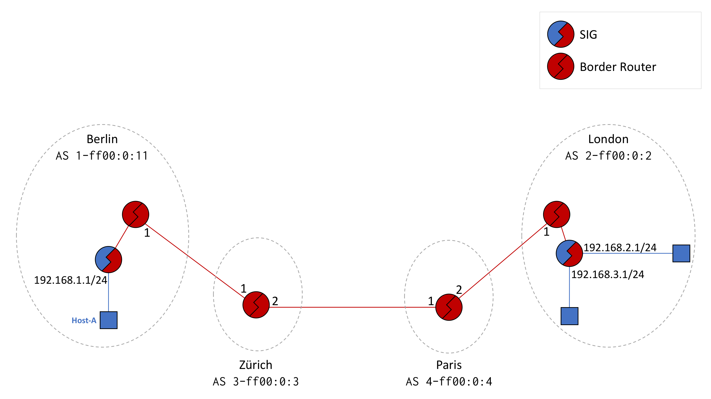
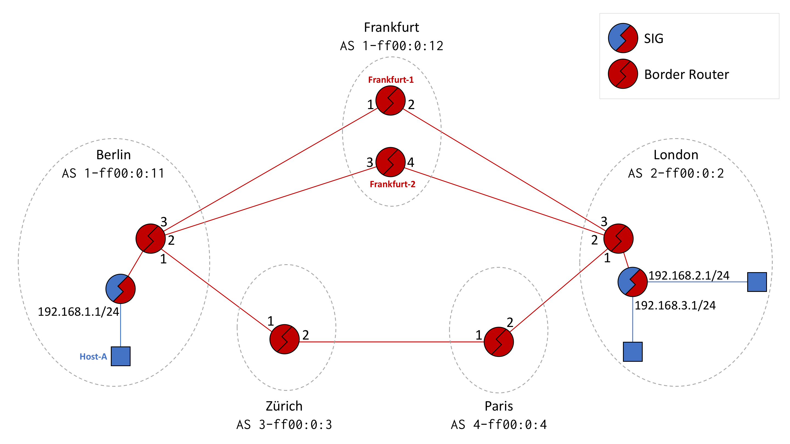

# SIG Configuration

This document describes how a SIG (SCION IP Gateway) can be manually configured via its JSON
configuration file.

SIGs connect IPv4 and/or IPv6 islands across SCION networks. In the most common scenario, SIGs sit
at the edge of both IP networks and the SCION network, tunneling all IP traffic by encapsulating it
in SCION packets. The health of SCION paths (that is, the sequences of SCION Autonomous Systems and
Interface IDs that packets transit) is continuously monitored, allowing SIGs to ensure fast
failover whenever network conditions degrade.

## Table of contents

-   [Basic path selection](#basic-path-selection)
    -   [Use case - Single path traffic](#use-case-1)
-   [Path policies](#path-policies)
-   [Policy-based path selection](#policy-based-path-selection)
    -   [Traffic policies](#traffic-policies)
    -   [Traffic classes](#traffic-classes)
    -   [Sessions](#sessions)
    -   [Path policies](#path-policies)
    -   [Use case - Multiple paths with failover](#multiple-paths-with-failover)
        -   [Choosing different paths for different traffic](#different-paths)
        -   [Session of last resort](#session-of-last-resort)

## Basic path selection <a id="basic-path-selection"> </a>

SIGs connect IP islands from different SCION ASes. Each SIG has a list of remote ASes statically
configured by the administrator. The list of remote ASes is configured via the JSON keys in the
top-level "ASes" JSON object. For example, to define two remote ASes `2-ff00:0:2` and `2-ff00:0:3`,
use the following:

```json
{
  "ASes": {
    "2-ff00:0:2": {
      ... remote AS config omitted ...
    },
    "3-ff00:0:3": {
      ... remote AS config omitted ...
    }
  }
}
```

Note that for a SIG to communicate with a remote SIG, it needs a path to the remote SIG's AS. Paths
are automatically obtained by the local SIG by querying the local SCION Daemon.

SIGs forward IP traffic according to their internal IP routing table. The routing table is
statically configured by the network administrator (dynamic modes of operation are planned for
future versions) via name "Nets" inside each remote AS definition. Note that in JSON, the IP
addresses are surrounded by quotes. The following example states that networks `192.168.2.0/24` and
`192.168.3.0/24` exist in remote AS `2-ff00:0:2`, and that the local SIG should route traffic for
these destinations to that remote AS:

```json
{
  "ASes": {
    "2-ff00:0:2": {
      "Nets": ["192.168.2.0/24", "192.168.3.0/24"],
      ... rest of config omitted ...
    }
  }
}
```

The network prefixes must be unique, and cannot overlap with the prefixes of any other remote AS
(e.g., in this case it is unsupported for a different remote AS to have an allocation for
`192.168.0.0/16`, since it overlaps with `192.168.2.0/24` and `192.168.3.0/24`, or to have an
allocation for `192.168.2.192/26` since it overlaps with `192.168.2.0/24`).

To send traffic, the local SIG also needs to know the address of the remote endpoint of the tunnel
(that is, at least one SIG in the remote AS). This is specified via name "Sigs":

```json
{
  "ASes": {
    "2-ff00:0:2": {
      "Nets": ["192.168.2.0/24", "192.168.3.0/24"],
      ... rest of config omitted ...
    }
  }
}
```

Once the configuration is loaded, the SIG will encapsulate IP traffic for networks `192.168.2.0/24`
and `192.168.3.0/24` in SCION packets and send them to AS `2-ff00:0:2` on address `192.168.2.1`. As
opposed to other tunneling protocols, it is mandatory (and does not cause a routing loop) in SIGs
for the address of the remote SIG to be included in the network prefixes of the remote AS. This is
because SCION is used to carry all the traffic, including session establishment and health
monitoring.

### Use case #1 - Single path traffic <a id="use-case-1"> </a>

In the topology below, two SIGs from two different ASes communicate across a single SCION path. The
Berlin AS (`1-ff00:0:11`) contains one IPv4 network (`192.168.1.0/24`) that is directly connected
to a SIG. The hosts in this network (e.g., HostA) want to talk to the hosts in the London AS
(`2-ff00:0:2`), located in networks `192.168.2.0/24` and `192.168.3.0/24`. The two ASes communicate
via the path that goes through the Zürich and Paris ASes.



Configuring a SIG is done by editing the JSON file. This can be done either via the SIG WebUI, or
by manually creating the file.

At a minimum, the config file must specify the following:

-   The known remote ASes;
-   The IP networks contained in each remote AS;

For example, a minimal configuration file for the Berlin SIG looks like:

```json
{
    "ASes": {
        "2-ff00:0:2": {
            "Nets": ["192.168.2.0/24", "192.168.3.0/24"]
        }
    }
}
```

The London SIG configuration file is similar:

```json
{
    "ASes": {
        "1-ff00:0:11": {
            "Nets": ["192.168.1.0/24"]
        }
    }
}
```

Once the file is in place (typically, this is `/etc/scion/sig.json`), the configuration file can be
reloaded by sending a SIGHUP signal to the SIG process.This will make the new configuration
immediately take effect. The signal can be sent manually (e.g., via `kill`) or via the following:

```bash
scion@berlin$ sudo systemctl kill -sSIGHUP sig.service
```

If the configuration could not be loaded (e.g., due to a syntax error) the SIG configuration
remains unchanged. In both cases, check the log to verify that the SIG reloaded the config
successfully:

```bash
scion@berlin$ tail /var/log/scion/sig*.log
2018-04-30 15:10:35.011305+0000 [INFO] reloadOnSIGHUP: reloading...
2018-04-30 15:10:35.012406+0000 [INFO] ReloadConfig: Adding AS... ia=2-ff00:0:2
2018-04-30 15:10:35.012475+0000 [INFO] Updated SIG ia=2-ff00:0:2 sig=2-ff00:0:2,[192.168.2.1]:10081:10080
2018-04-30 15:10:35.012620+0000 [INFO] ReloadConfig: Added AS ia=2-ff00:0:2
2018-04-30 15:10:35.012658+0000 [INFO] reloadOnSIGHUP: reload done success=true
```

## Path policies <a id="path-policies"></a>

A path policy filters out sets of paths depending on a set of predicates.

### Hop Predicate (HP)

A hop predicate is of the form **ISD-AS#IF**, where _0_ can be used as a wildcard for **ISD**,
**AS** and **IF** indepedently. If the **AS** identifier is set to _0_, the **IF** identifier must
also be set to _0_. To specify both interfaces of an AS, one must separate them by `,` ie.
**ISD-AS#IF1,IF2**.

If the tail elements in a HP are 0, they can be omitted. See the following examples for details.

Examples:

-   Match interface _2_ and _3_ of AS _1-ff00:0:133_: `1-ff00:0:133#2,3`"
-   Match interface _2_ of AS _1-ff00:0:133_: `1-ff00:0:133#2`
-   Match any interface of AS _1-ff00:0:133_: `1-ff00:0:133#0` or `1-ff00:0:133`
-   Match any interface in ISD _1_: `1-0#0`, `1-0` or `1`

### Policy

A policy is defined by a policy object. It can have the following attributes:

-   [`acl`](#ACL) (list of HPs, preceded by `+` or `-`)
-   [`sequence`](#Sequence) (space separated list of HPs, one HP for every AS on a path)
-   [`extends`](#Extends) (list of extended policies)

### Specification

#### ACL

##### Operators

The ACL uses the following operators:

-   `+` (allow predicate)
-   `-` (deny predicate)

The ACL can be used to deny (blacklist) or allow (whitelist) ISDs, ASes and IFs. A deny entry is of
the following form `- ISD-AS#IF`, where the second part is a [HP](#HP). If a deny entry matches any
hop on a path, the path is not allowed.

An allow entry uses `+` with a HP, ie. `+ ISD-AS#IF`. For a path to be allowed, every hop of the
path must be allowed by the ACL. When using allow and deny entries in the same ACL, the first
matched entry wins. Thus, if an interface is denied by the first entry but allowed by the second
entry it is still denied.

Every ACL must end with a blanket accept or deny (i.e. `+` or `-`, or equivalent such as
`+ 0-0#0`). If a policy has no acl attribute (and doesn't inherit one from any policy it extends),
then by default everything is whitelisted.

The following is an example for allowing all interfaces in ASes _1-ff00:0:133_ and _1-ff00:0:120_,
but denying all other ASes in ISD _1_. The last entry makes sure that any other ISD is allowed.

```yaml
- acl_policy_example:
      acl:
          - "+ 1-ff00:0:133"
          - "+ 1-ff00:0:120"
          - "- 1"
          - "+"
```

#### Sequence

The sequence is a string of space separated HPs. The [operators](#Operators) can be used for
advanced interface sequences.

The following example specifies a path from any interface in AS _1-ff00:0:133_ to two subsequent
interfaces in AS _1-ff00:0:120_ (entering on interface _2_ and exiting on interface _1_), then
there are two wildcards that each match any AS. The path must end with any interface in AS
_1-ff00:0:110_.

```yaml
- sequence_example_2:
      sequence: "1-ff00:0:133#0 1-ff00:0:120#2,1 0 0 1-ff00:0:110#0"
```

Any path that is matched by the above policy must traverse three transit ASes. In many cases the
number of ASes or hops is not known. With the regex-style it is possible to express such sequences.

#### Extends

Path policies can be composed by extending other policies. The `extends` attribute requires a list
of named policies. If an attribute exists in multiple policies in that list, the last occurrence has
precedence. Also, an attribute specified at top level (the policy that has the `extends` attribute)
always has precedence over attributes of an extended policy.

The following example uses three sub-policies to create the top-level policy. As `sub_pol_1` and
`sub_pol_3` both define an ACL but `sub_pol_3` has precedence, the ACL of `sub_pol_1` is discarded.

```yaml
- extends_example:
      extends:
          - sub_pol_1
          - sub_pol_2
          - sub_pol_3

- sub_pol_1:
      acl:
          - "- 1-ff00:0:133#0"
          - "+"

- sub_pol_2:
      sequence: "0 1-ff00:0:110#0 1-ff00:0:110#0 0"

- sub_pol_3:
      acl:
          - "- 1-ff00:0:131#0"
          - "- 1-ff00:0:132#0"
          - "- 1-ff00:0:133#0"
          - "+"
```

## Policy-based path selection <a id="policy-based-path-selection"> </a>

SIGs can be configured to forward packets across certain paths, depending on the values of various
packet fields. To implement this, SIGs define and support the following:

-   [Traffic policies](#traffic-policies)
-   [Traffic classes](#traffic-classes)
-   [Sessions](#sessions)
-   [Path policies](#path-policies)

Traffic flow is controlled via **traffic policies**. Each policy is composed of two elements:

-   A class name, used to identify the **traffic class** used to match the packets.
-   A list of **sessions**, in order of priority, used to tell the SIG which session should be used
    to send the packet.

A **session** is the state related to a tunneling (i.e., encapsulation) session. The session
contains information such as usable paths, the health of the active path and sequence numbers.

Each session is defined by a name (a number between 0 and 255), and a **path policy** that chooses
the paths that can be used (out of the pool of all known paths).

The following sections take a more in-depth look at these concepts, and how they can be configured.

### Traffic classes <a id="traffic-classes"> </a>

A packet is said to match a traffic class if the evaluation of the conditions in the traffic class
returns true. The conditions are evaluated on the raw content of each packet. Conditions can be
composed, thus creating arbitrarily complex classifiers.

Classes can be written using the following conditions:

-   **CondAllOf**: contains a list of subconditions. Returns true if all subconditions yield true.
    If empty, it returns true.
-   **CondAnyOf**: contains a list of subconditions and returns true if at least one subcondition
    yields true. If empty, it return true.
-   **CondNot**: contains a single subcondition; CondNot returns the negation of the result of the
    subcondition.
-   **CondBool**: can be true or false, and always evaluates to its chosen value. This is useful
    during testing.
-   **CondIPv4**: contains a condition for an IPv4 packet. Possible options are:
    -   **MatchSource**: checks whether the source address of the packet is within the network in
        field "Net".
    -   **MatchDestination**: checks whether the destination address of the packet is within the
        network in field "Net".
    -   **MatchDSCP**: checks whether the ToS/DSCP fields of the packet exactly match the value in
        field "DSCP".

Classes are defined in the top level of the JSON config file, under name "Classes".

A simple traffic class that selects traffic coming from network `192.168.1.0/24` is defined as
follows:

```json
"Classes": {
  "example-source": {
    "CondIPv4": {"MatchSource": {"Net": "192.168.1.0/24"}}
  }
}
```

Note that we also needed to specify a name for the class, in this case `example-source`. The name
is later used in traffic policies to refer to this specific class.

To select traffic coming from multiple networks, compose multiple conditions using **CondAnyOf**:

```json
"Classes": {
  "example-multiple-source": {
    "CondAnyOf": [
      {"CondIPv4": {"MatchSource": {"Net": "192.168.1.0/24"}}},
      {"CondIPv4": {"MatchSource": {"Net": "192.168.2.0/24"}}},
      {"CondIPv4": {"MatchSource": {"Net": "192.168.3.0/24"}}}
    ]
  }
}
```

**CondAnyOf** and **CondAllOf** can be used together to create more complex classes. For example,
to select either traffic going from `192.168.1.0` to `192.168.2.0`, or from `192.168.3.0` to
`192.168.4.0`:

```json
"Classes": {
  "example-src-dst-match": {
    "CondAnyOf": [
      {
        "CondAllOf": [
          {"CondIPv4": {"MatchSource": {"Net": "192.168.1.0/24"}}},
          {"CondIPv4": {"MatchDestination": {"Net": "192.168.2.0/24"}}}
        ]
      },
      {
        "CondAllOf": [
          {"CondIPv4": {"MatchSource": {"Net": "192.168.3.0/24"}}},
          {"CondIPv4": {"MatchDestination": {"Net": "192.168.4.0/24"}}}
        ]
      }
    ]
  }
}
```



Refer to the topology above. It similar to the topology in the previous use case, except a new
transit AS, Frankfurt, is available between Berlin and London. As opposed to the other ASes, the
Frankfurt AS has two border routers. Suppose Berlin wants to communicate with London. In this case,
the following SCION paths are available (note that depending on how Frankfurt operates internally,
more paths in addition to those listed below might exist):

```basic
1-ff00:0:11#3, 1-ff00:0:12#1, 1-ff00:0:12#2, 2-ff00:0:2#3
1-ff00:0:11#2, 1-ff00:0:12#3, 1-ff00:0:12#4, 2-ff00:0:2#2
1-ff00:0:11#1, 3-ff00:0:3#1, 3-ff00:0:3#2, 4-ff00:0:4#1, 4-ff00:0:4#2, 2-ff00:0:2#1
```

The path elements above are in ISD-AS#IFID notation. The same notation can be used when defining
path policy sequences.

A sequence specifies a list of HopPredicates a path must be made of. For example, to select only
the path going through border router Frankfurt-1 in the Frankfurt AS, we can define the following
sequence:

```yaml
sequence: "1-ff00:0:11 1-ff00:0:12#1 2-ff00:0:2"
```

This means that paths going through ISD 1, AS `ff00:0:12` and IFID 1 are selected. Paths going
through border router Frankfurt-2 are avoided, so sessions using this path policy will never
forward traffic through Frankfurt-2. If we don't care about the IFID and want to select all paths
going through any border router in the Frankfurt AS, we can replace the IFID in the path policy
with a wildcard 0:

```basic
1-ff00:0:12#0
```

To write a path policy in JSON format, the sequence string is embedded in a policy object, with
the:

```json
"policy-name": {"Sequence": "4-ff00:0:4#0"}
```

Path policies are specified in the SIG config file under the top level name "PathPolicies". The
format is the following:

```json
"PathPolicies": {
  "policy-name": {
    "Sequence": "1-ff00:0:11 1-ff00:0:12#1 2-ff00:0:2"
  }
}
```

One useful configuration pattern is the path avoidance pattern, which can be used to prevent
routing through certain ISDs and ASes. Suppose ISD 10 is now connected to the SCION network, but
this ISD has a history of data theft and other security issues. We want to avoid routing through
this ISD. The simplest way to do this is to only select paths that do not go through ISD 10 using
the ACL:

```json
"PathPolicies": {
  "policy-name": {
    "Sequence": "...",
    "ACL": [
      "- 10",
      "+"
    ]
  }
}
```

### Sessions <a id="sessions"> </a>

Sessions describe independent SIG to SIG tunneling states. Sessions are defined per remote AS,
under name "Sessions":

```json
{
  "ASes": {
    "2-ff00:0:2": {
       "Nets": ["192.168.2.0/24", "192.168.3.0/24"],
       "Sessions": {
         ... define sessions here ...
       }
    }
  }
}
```

To select eligible paths, each session either needs to reference a **PathPolicy** object, or the
empty quotes "" (meaning no filter, and all paths are used). For example, to define a session that
allows all paths and a session that uses the `go-trough-either` paths defined in the previous
section, use the following:

```json
"Sessions": {
  "0": "",
  "10": "go-through-either"
}
```

In the above example, two session are defined. The session with ID 0 will use all available paths
to the destination AS. The session with ID 10 will only use paths that go through ISD 1 or ISD 2
(as defined in the previous section). Session IDs are only used to identify the session, and do not
represent any form of priority.

### Traffic policies <a id="traffic-policies"> </a>

Traffic policies map traffic classes to sessions. Traffic policies are configured under name
"PktPolicies" in the remote AS configuration:

```json
{
  "ASes": {
    "2-ff00:0:2": {
      "Nets": ...omitted...,
      "Sessions": ...omitted...,
      "PktPolicies": [
        {
          "Classname": <classname>,
          "SessIDs": <list-of-sessions>
        }
      ]
    }
  }
}
```

In an actual configuration file, value `<classname>` above is replaced with a previously defined
traffic class (see section [Traffic classes](traffic-classes)), while value `<list-of-sessions>` is
replaced with a list of session names in decreasing order of priority. If the first session in the
list is healthy (i.e., has at least one usable path and traffic can flow across the path), it will
always be used. If the first session is unhealthy, the next one is used and so on and so forth.

To see a `PktPolicies` example, recall that in the previous sections we defined the following
sessions, path policies and traffic classes:

```json
"Sessions": {
  "0": "",
  "10": "go-through-either"
}
```

```json
"PathPolicies": {
  "go-through-either": {
    "Options": [
        {
            "Policy": {
                "ACL": [
                  "+ 1"
                  "-"
                ]
            }
        },
        {
            "Policy": {
                "ACL": [
                  "+ 2"
                  "-"
                ]
            }
        }
    ]
  }
}
```

```json
"Classes": {
  "example-source": {
    "CondIPv4": {"MatchSource": {"Net": "192.168.1.0/24"}}
  }
}
```

For simplicity, we do not include the whole file, but note that `Classes`, `PathPolicies` and
`Sessions` need to be inserted at specific points in the JSON file. One example of `PktPolicies`,
based on the classes and sessions above could look like:

```json
"PktPolicies": [
  {
    "Classname": "example-source",
    "SessIDs": [10, 0],
  }
]
```

In this example, we state that IP traffic matching traffic class `example-source` should be
forwarded across session 10, if possible. Also, session 10 uses the `go-through-either` path
policy, which means that it will only allow paths going through ISD 1 (`1-0#0`) or ISD 2 (`2-0#0`).
If session 10 is unhealthy, session 0 will be used. This session doesn't specify any path policy,
so any path can be used. Note that the list of session names does not include quotes.

### Use case #2 - Multiple paths with failover <a id="multiple-paths-with-failover"> </a>

This use case presents how traffic classes, path policies, sessions and traffic policies come
together to implement path failover policies in the SIG.

SIGs monitor paths to detect network failures. As soon as a path is down, the SIG can transparently
change to the remaining healthy paths. The topology below (which is the same as the topology in the
Path policy section) presents such a scenario.

The Berlin AS wants to communicate with the London AS. If all the paths are healthy, the path
through Zürich should be preferred. If the path through Zürich becomes unavailable, traffic should
start flowing on the paths through Frankfurt.


To implement this, first the packets must be classified. Define one class matching any packet:

```json
"Classes": {
  "all": {
    "CondBool": true
  }
}
```

Then, define a path policy for the paths through Zürich:

```json
"go-through-zuerich": {
  "Sequence": "1-ff00:0:11 3-ff00:0:3 4-ff00:0:4 2-ff00:0:2"
}
```

And a path policy for the path through Frankfurt:

```json
"go-through-zuerich": {
  "Sequence": "1-ff00:0:11 1-ff00:0:12 2-ff00:0:2"
}
```

Putting it all together, the "PathPolicies" section of the configuration file should now look like:

```json
"PathPolicies": {
  "go-through-zuerich": {
    "Sequence": "1-ff00:0:11 3-ff00:0:3 4-ff00:0:4 2-ff00:0:2"
  },
  "go-through-zuerich": {
    "Sequence": "1-ff00:0:11 1-ff00:0:12 2-ff00:0:2"
  }
}
```

Now that the path policies are in place, define SIG sessions through Zürich and Frankfurt for the
remote London AS:

```json
"ASes": {
  "2-ff00:0:2": {
    "Nets": ["192.168.2.0/24", "192.168.3.0/24"],
    "Sessions": {
      "10": "go-through-zuerich",
      "20": "go-through-frankfurt"
    }
  }
}
```

With the sessions in place, we can define the policy:

```json
"PktPolicies": [
  {"Classname": "all", "SessIDs": [10, 20]}
]
```

The final configuration file for the Berlin SIG:

```json
{
  "ASes": {
    "2-ff00:0:2": {
      "Nets": ["192.168.2.0/24", "192.168.3.0/24"],
      "Sessions": {
        "10": "go-through-zuerich",
        "20": "go-through-frankfurt"
      },
      "PktPolicies": [
        {"Classname": "all", "SessIDs": [10, 20]}
      ]
    }
  },
  "Classes": {
    "all": {
      "CondBool": true
    }
  }
  "PathPolicies": {
    "go-through-zuerich": {
      "Sequence": "1-ff00:0:11 3-ff00:0:3 4-ff00:0:4 2-ff00:0:2"
    },
    "go-through-zuerich": {
      "Sequence": "1-ff00:0:11 1-ff00:0:12 2-ff00:0:2"
    }
  }
}
```

#### Choosing different paths for different traffic <a id="different-paths"> </a>

Suppose traffic going to `192.168.2.0/24` should prefer paths through Frankfurt, and only go
through Zürich if that path becomes unavailable. Also, traffic to `192.168.3.0/24` should prefer
going through Zürich, and only go through Frankfurt if that path becomes unavailable. In this case,
the path policies and sessions from the previous section remain the same. However, we need to
define two new classes for the criteria we chose:

```json
"Classes": {
  "network-1-traffic": {
    "CondIPv4": { "MatchDestination": {"Net": "192.168.2.0/24"}}
  },
  "network-2-traffic": {
    "CondIPv4": { "MatchDestination": {"Net": "192.168.3.0/24"}}
  }
}
```

Now, define the policies that map the classes to sessions. Sessions 10 and 20 are the ones from the
previous section.

```json
"PktPolicies": [
  {"Classname": "network-1-traffic", "SessIDs": [20, 10]},
  {"Classname": "network-2-traffic", "SessIDs": [10, 20]}
]
```

For traffic going to `192.168.2.0/24`, we prefer session 20 (with paths through Frankfurt) and
choose 10 (with paths through Zürich) only if the former is unhealthy. For traffic going to
`192.168.3.0/24`, we prefer paths through Zürich, and then through Frankfurt.

#### Session of last resort <a id="session-of-last-resort"> </a>

One useful pattern is to always have a "session of last resort" that allows any path to be used.
For this, define a session without a path policy (typically, session 0):

```json
"Sessions": {
  "10": "go-through-zuerich",
  "20": "go-through-frankfurt",
  "0": "",
}
```

This session can then be used at the end of policies to have traffic use any available path if the
preferred ones are no longer available:

```json
"PktPolicies": [
  {"Classname": "network-1-traffic", "SessIDs": [20, 10, 0]},
  {"Classname": "network-2-traffic", "SessIDs": [10, 20, 0]}
]
```

In this topology, session 0 will not provide any additional reliability because all the paths are
already used in sessions 10 and 20. However, in more complex deployments where the number of paths
is much greater a session of last resort can be useful to ensure that traffic continues to flow.
